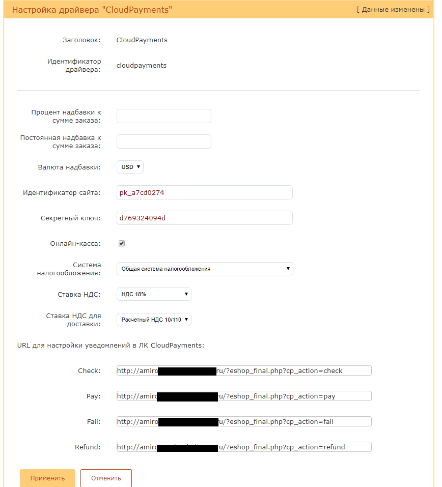

# CloudPayments модуль для Wordpress - eCommerce
Модуль позволит с легкостью добавить на ваш сайт оплату банковскими картами через платежный сервис [CloudPayments](https://cloudpayments.ru).


### Возможности:  
• Одностадийная схема оплаты;  
• Поддержка онлайн-касс (ФЗ-54);  
• Отправка чеков по email;  
• Отправка чеков по SMS;  
• Отдельный параметр НДС для доставки;

### Совместимость
• AmiroCMS v.7.0.x.x и выше;

## Техническая настройка
### Личный кабинет CloudPayments
В личном кабинете CloudPayments в настройках сайта необходимо включить следующие уведомления:

* **Запрос на проверку платежа** (Сheck):\
http://domain.ru/eshop_final.php?cp_action=check
* **Уведомление о принятом платеже** (Pay):\
http://domain.ru/eshop_final.php?cp_action=pay
* **Уведомление при отклоненном платеже* (Fail):\
http://domain.ru/eshop_final.php?cp_action=fail
* **Уведомление о возврате платежа* (Refund):\
http://domain.ru/eshop_final.php?cp_action=refund

Где domain.ru — доменное имя вашего сайта.
Во всех случаях требуется выбирать вариант по умолчанию: кодировка — UTF-8, HTTP-метод — POST, формат — CloudPayments
Данные URL можно скопировать из настройки модуля CloudPayments в панели администрирования AmiroCMS

  
### Панель администратора AmiroCMS
Основные сведения по настройке платежных систем указаны в документации AmiroCMS http://manual.amiro.ru/doc/servisnye-moduli/nastrojka-sistemy/nastrojki-platezhnyh-sistem/#q3

В способах оплаты (Сервис -> Настройка системы -> Способы оплаты) необходимо включить способ оплаты CloudPayments и указать у него следующие настройки:
* **Идентификатор сайта** — Public id сайта из личного кабинета CloudPayments
* **Секретный ключ** — API Secret из личного кабинета CloudPayments

#### При использовании интеграции с онлайн-кассой
* **Онлайн-касса** — Включение/отключение формирования онлайн-чека при оплате
* **Система налогообложения** — Тип системы налогообложения. Возможные значения перечислены в документации CloudPayments https://cloudpayments.ru/Docs/Directory#taxation-system
* **Ставка НДС** — Указание ставки НДС. Все возможные значения указаны в документации https://cloudpayments.ru/Docs/Kassa#data-format
* **Ставка НДС для доставки** — Указание ставки НДС для доставки. Аналогично ставке НДС.

После указания всех данных сохранить настройки.

Валюта и язык виджета определяются автоматически на основании текущего языка сайта и валюты.



Затем в настройках AmiroCMS (Сервис -> Настройка системы) в параметре "Доступные способы оплаты" указать CloudPayments как доступную систему для оплаты.


Изменение текста описания в виджете можно сделать через локализацию (Менеджер сайта -> Шаблоны моделей -> Локализации).
Для этого требуется найти шаблон eshop_purchase.lng
 


И изменить переменную локализации order_title


### Установка модуля вручную
1. Разархивируйте модуль и скопируйте все файлы из каталога distrib/configs/ami_fake/cloudpayments/driver в _local/eshop/pay_drivers/cloudpayments
2. Добавьте в шаблон локализации eshop_purchase.lng (см. изменение текста описания в виджете)
    ```
    %%pay_with_cloudpayments_option%en%%
    CloudPayments
    %%pay_with_cloudpayments_option%ru%%
    CloudPayments
    ```
3. Далее следуйте инструкции в разделе "Панель администратора AmiroCMS"